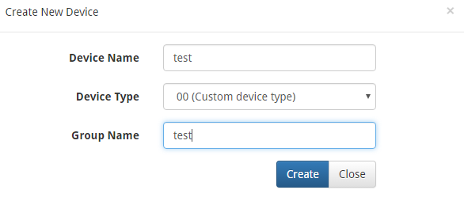
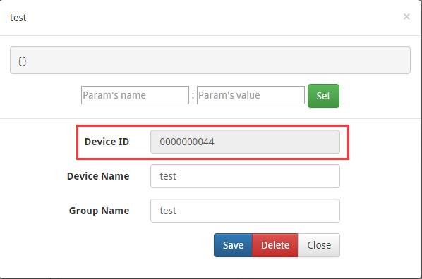
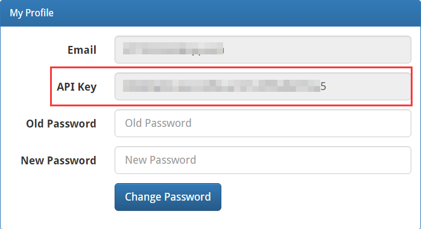
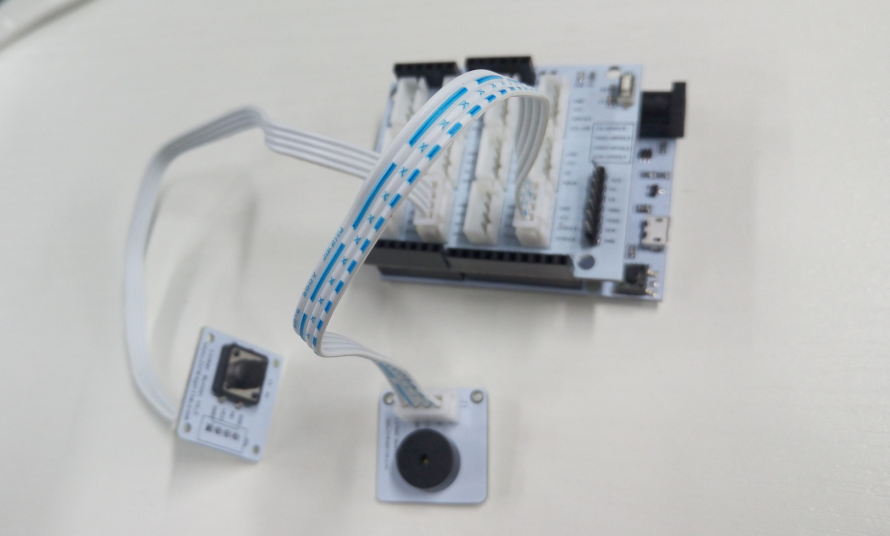
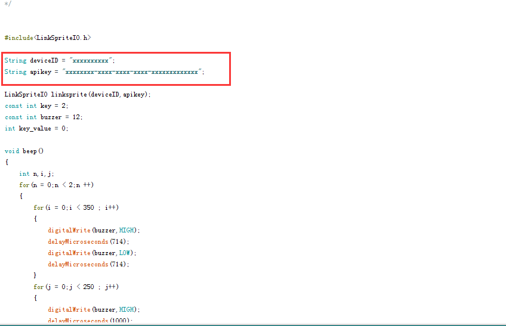
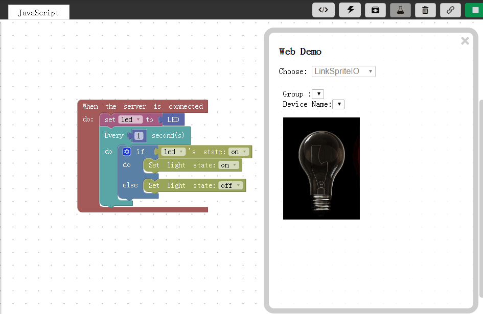
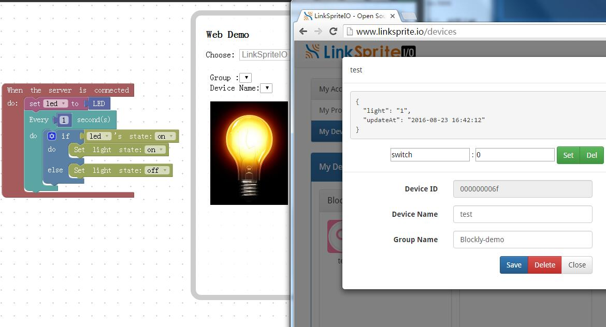

# WIFI Door Bell

## Introduction
WIFI Door Bell is a simple IoT example that use wifi board--LinkNode D1 connected with LinkSpriteIO,then use blockly check the the door bell.

## Pre-requisites
* LinkNode D1 x 1
* Linker Base For D1 x 1
* Linker Button x 1
* Linker Buzzer x 1
* Linker cable x 2

## Tutorial
#### LinkSpriteIO
* Sign up /sign in [LinkSpriteIO](www.linksprite.io)
* Create a DIY device
* Get the apikey and device id

* get the device ID

* get the apikey

#### LinkNode D1
* Connect the hardware
* Download the test [code](https://github.com/delongqilinksprite/linknoded1-beep.git)
* Download the LinkSpriteIO [library](https://github.com/delongqilinksprite/LinkSpriteIO.git)
* Change the code's apikey and deviceID
* Upload the code on LinkNode D1

* hardware connect

* code

#### Blockly
write the blockly code for the door bell to check the state.and then press the button and you will found the light bright.

#### Notes
if you first time use the LinkNode D1 you should config the wifi first! you can learn form [LinkNode R4](https://github.com/delongqilinksprite/LinkNodeR4-app.git)